```mermaid
flowchart TD
    A[Start] --> B[Input number of bulbs n]
    B --> C[Count perfect squares ≤ n]
    C --> D[Return floorsqrtn]
    D --> E[End]

```

---

## 💡 C++ Code Explanation with Diagrams

---

### 🚀 Problem: Bulb Switcher

#### 🔍 Problem Statement

There are `n` bulbs that are initially off. You turn on all the bulbs, then toggle every 2nd, every 3rd, and so on until the `n`th round. You need to find how many bulbs are **on** after all rounds.

---

#### ✅ Approach

* A bulb ends up being **on** only if it is toggled an **odd number of times**.
* A bulb is toggled in each round that is a divisor of its position.
* So, a bulb is toggled as many times as it has divisors.
* Only **perfect squares** have an odd number of divisors.
* Hence, the number of bulbs that remain on is equal to the number of perfect squares ≤ `n`.

---

#### 🧾 Code

```cpp
class Solution {
public:
    int bulbSwitch(int n) {
        return sqrt(n);
    }
};
```

---

#### 📈 Time & Space Complexity

* **Time Complexity:** O(1)
* **Space Complexity:** O(1)

---

#### 🧠 Insight

This is a math-based trick question. You don't need to simulate the toggling process — just count perfect squares up to `n`.

---

#### 🔁 Flowchart (Mermaid)



---

### 🚀 Problem: Delete Middle Node of a Linked List

#### 🔍 Problem Statement

Given the head of a linked list, delete the **middle node** and return the modified list. If there is only one node, return `nullptr`.

---

#### ✅ Approach

* Use the **slow and fast pointer** technique:

  * `slow` moves one step at a time
  * `fast` moves two steps at a time
* When `fast` reaches the end, `slow` will be at the middle.
* Maintain a `prev` pointer to delete `slow` from the list.

---

#### 🧾 Code

```cpp
class Solution {
public:
    ListNode* deleteMiddle(ListNode* head) {
        if (!head || !head->next) return nullptr;

        ListNode* prev = nullptr;
        ListNode* slow = head;
        ListNode* fast = head;

        while (fast && fast->next) {
            prev = slow;
            slow = slow->next;
            fast = fast->next->next;
        }

        if (prev) prev->next = slow->next; 
        delete slow;

        return head;
    }
};
```

---

#### 📈 Time & Space Complexity

* **Time Complexity:** O(n)
* **Space Complexity:** O(1)

---

#### 🧠 Insight

This is a classic use of the **two-pointer technique** to efficiently find and remove the middle node in a single pass.

---

#### 🔁 Flowchart (Mermaid)


