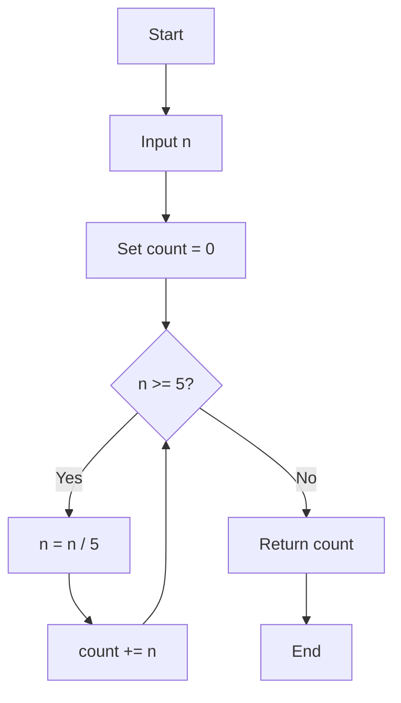
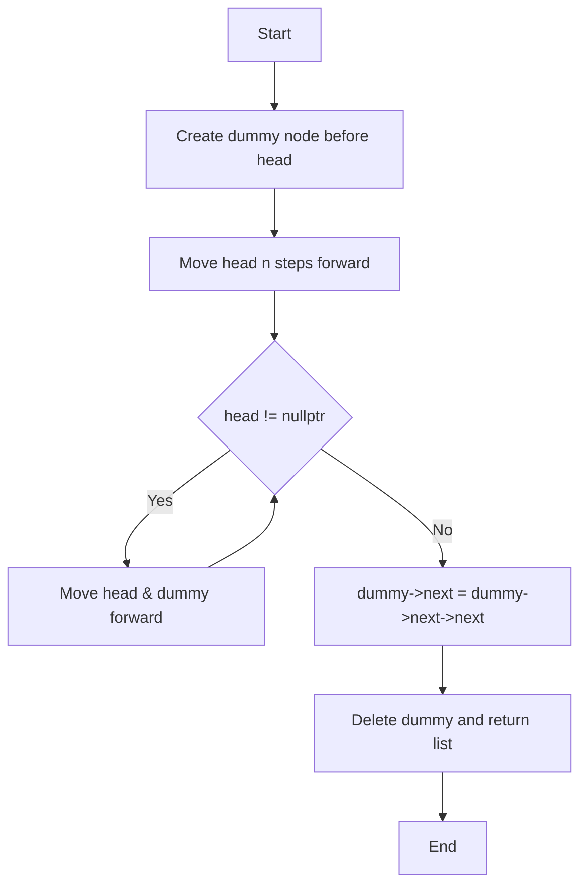

---

## 💡 C++ Code Explanation with Diagrams

---

### 🚀 Problem: Factorial Trailing Zeros

#### 🔍 Problem Statement

Given an integer `n`, return the number of trailing zeros in `n!` (n factorial).

---

#### ✅ Approach

* Trailing zeros are produced by multiplying 2 and 5.
* There are always more 2s than 5s in factorials.
* So, count the number of **multiples of 5**, 25, 125, etc. in `n`.
* Add `n/5 + n/25 + n/125 + ...` until `n` becomes less than 5.

---

#### 🧾 Code

```cpp
class Solution {
public:
    int trailingZeroes(int n) {
        int count = 0;
        while (n >= 5) {
            n /= 5;
            count += n;
        }
        return count;
    }
};
````

---

#### 📈 Time & Space Complexity

* **Time Complexity:** O(log₅n)
* **Space Complexity:** O(1)

---

#### 🧠 Insight

This is a classic math problem — no need to compute factorials! Use prime factorization logic instead.

---

#### 🔁 Flowchart (Mermaid)



---

### 🚀 Problem: Remove Nth Node from End of List

#### 🔍 Problem Statement

Given the head of a linked list, remove the `n`-th node from the end of the list and return its head.

---

#### ✅ Approach

* Use a dummy node before head to handle edge cases.
* Move `head` `n` steps ahead.
* Use another pointer `dummy` from the beginning.
* Move both `head` and `dummy` together until `head` reaches null.
* Then `dummy->next` is the node to remove.

---

#### 🧾 Code

```cpp
class Solution {
public:
    ListNode* removeNthFromEnd(ListNode* head, int n) {
        ListNode* res = new ListNode(0, head);
        ListNode* dummy = res;

        for (int i = 0; i < n; i++) {
            head = head->next;
        }

        while (head != nullptr) {
            head = head->next;
            dummy = dummy->next;
        }

        dummy->next = dummy->next->next;

        ListNode* result = res->next;
        delete res;
        return result;        
    }
};
```

---

#### 📈 Time & Space Complexity

* **Time Complexity:** O(n)
* **Space Complexity:** O(1)

---

#### 🧠 Insight

Dummy nodes make edge cases (like deleting the first node) easy to handle. This is a neat trick for cleaner code.

---

#### 🔁 Flowchart (Mermaid)



