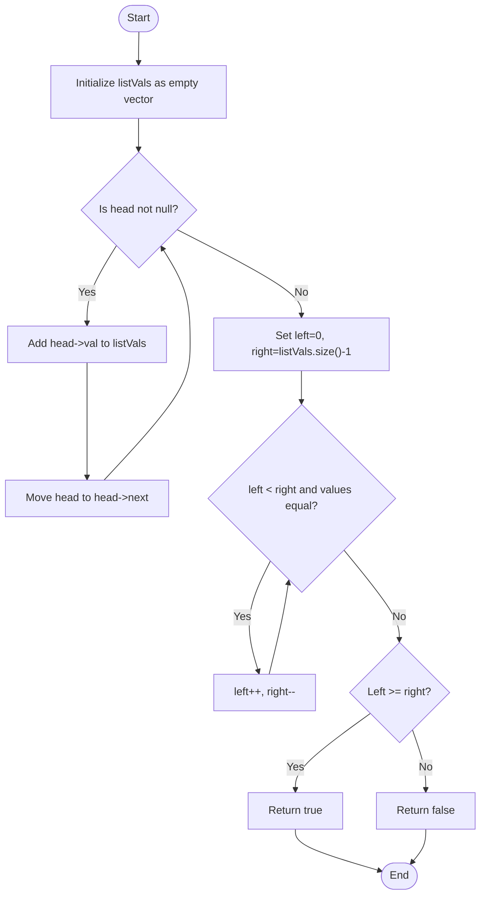
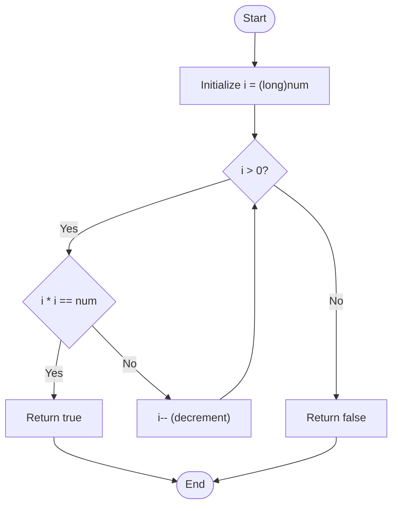

# 💡 C++ Code Explanation with Diagrams

## 🚀 Problem 1: Palindrome Linked List

### 🔍 Problem Statement
Given the head of a singly linked list, determine if it is a palindrome.

---

### ✅ Approach

1. Traverse the entire linked list.
2. Store each node's value in a vector.
3. Use two pointers (`left` from start, `right` from end).
4. Compare values until the pointers meet or cross.
5. Return `true` if all corresponding values are equal; else `false`.

---

### 🧾 Code

```cpp
class Solution {
public:
    bool isPalindrome(ListNode* head) {
        vector<int> listVals;
        while (head) {
            listVals.push_back(head->val);
            head = head->next;
        }

        int left = 0, right = listVals.size() - 1;
        while (left < right && listVals[left] == listVals[right]) {
            left++;
            right--;
        }
        return left >= right;
    }
};
```

---

### 📈 Time & Space Complexity

- **Time Complexity**: O(n)
- **Space Complexity**: O(n) due to vector storage

---

### 🧠 Insight
This is a simple solution leveraging extra space. A more space-efficient solution would reverse the second half of the list and compare in-place.

---

### 🔁 Flowchart (Mermaid)



---

## 🚀 Problem 2: Valid Perfect Square

### 🔍 Problem Statement
Given a positive integer `num`, return `true` if `num` is a perfect square or `false` otherwise.

---

### ✅ Approach

1. Start a loop from `i = num` down to `1`.
2. For each `i`, check if `i * i == num`.
3. If yes, return `true`.
4. If no perfect square is found, return `false`.

---

### 🧾 Code

```cpp
class Solution {
public:
    bool isPerfectSquare(int num) {
        for(long i = (long)num; i > 0; i--)
        {
            if(i * i == num)
                return true;
        }
        return false;
    }
};
```

---

### 📈 Time & Space Complexity

- **Time Complexity**: O(n)
- **Space Complexity**: O(1)

---

### 🧠 Insight
This is a brute-force approach. A more optimal solution would be binary search from `1` to `num`.

---

### 🔁 Flowchart (Mermaid)



---


