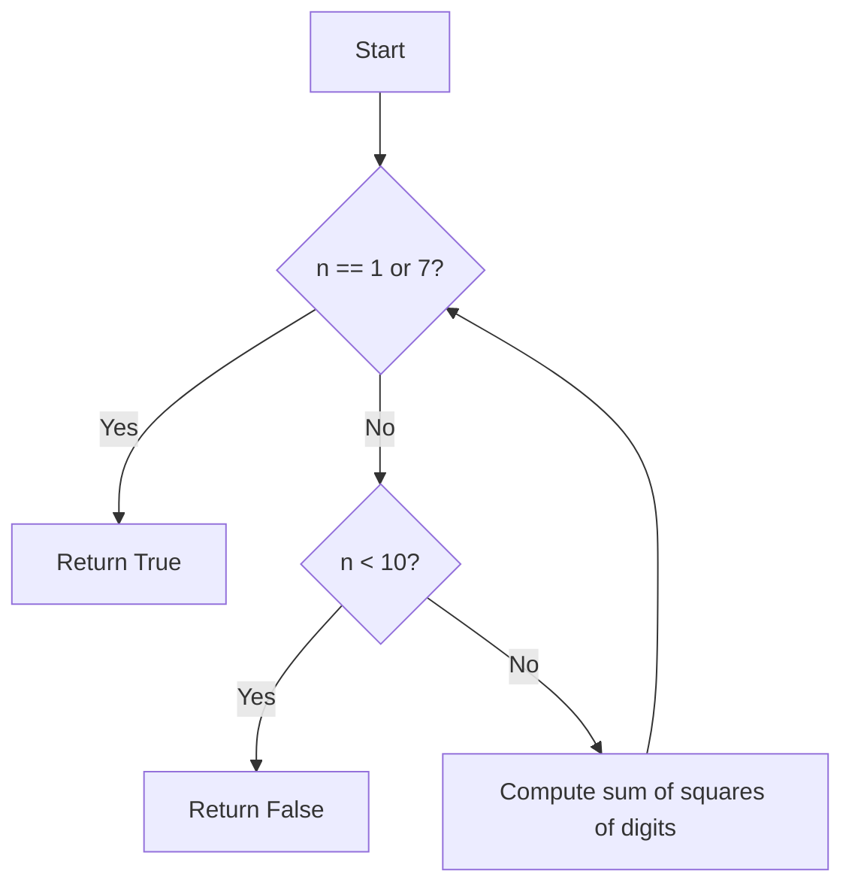
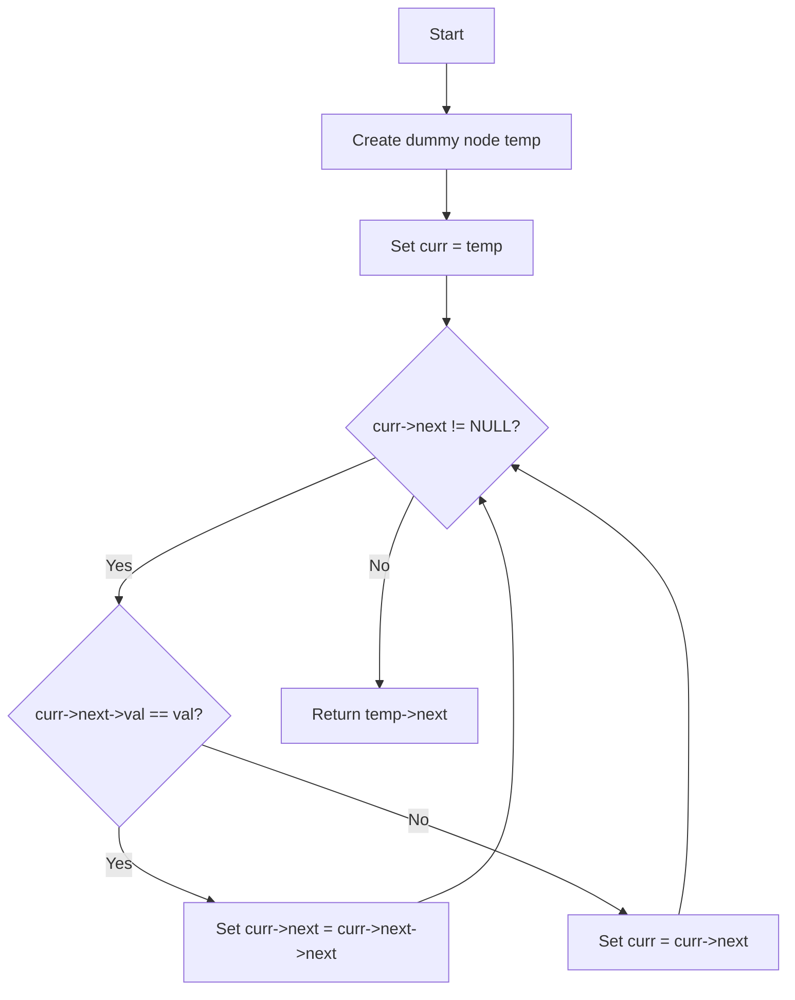

Here's a README file based on your format, covering both **Happy Number** and **Remove Linked List Elements** problems:

---

# 💡 C++ Code Explanation with Diagrams

---

## 🚀 Problem 1: Happy Number

### 🔍 Problem Statement

A **happy number** is a number defined by the following process:

* Starting with any positive integer, replace the number by the sum of the squares of its digits.
* Repeat the process until the number equals 1 (where it will stay), or it loops endlessly in a cycle that does not include 1.
* Those numbers for which this process ends in 1 are happy numbers.

### ✅ Approach

* Base condition: if `n` becomes 1 or 7, return true.
* If `n` is a single digit and not 1 or 7, return false.
* Otherwise:

  * Break the number into its digits.
  * Calculate the square of each digit and sum them.
  * Recursively check if the resulting sum is a happy number.

### 🧾 Code

```cpp
class Solution {
public:
    bool isHappy(int n) {
        if(n == 1 || n == 7) return true;
        else if(n < 10) return false;
        else {
            int sum = 0;
            while(n > 0) {
                int temp = n % 10;
                sum += temp * temp;
                n = n / 10;
            }
            return isHappy(sum);
        }
    }
};
```

### 📈 Time & Space Complexity

* **Time Complexity:** O(log n) 
* **Space Complexity:** O(1) 


### 🔁 Flowchart (Mermaid)



---

## 🚀 Problem 2: Remove Linked List Elements

### 🔍 Problem Statement

Given the `head` of a linked list and an integer `val`, remove all the nodes of the linked list that have `val` as their value, and return the new head.

### ✅ Approach

* Use a dummy node pointing to the head for easier edge case handling.
* Use a `curr` pointer starting from the dummy node.
* Traverse the list:

  * If `curr->next->val == val`, skip the node by updating the `next` pointer.
  * Else, move to the next node.
* Return `dummy->next` as the new head.

### 🧾 Code

```cpp
class Solution {
public:
    ListNode* removeElements(ListNode* head, int val) {
        ListNode *temp = new ListNode(0);
        temp->next = head;
        ListNode *curr = temp;
        while(curr->next != NULL) {
            if(curr->next->val == val) 
                curr->next = curr->next->next;
            else 
                curr = curr->next;
        }
        return temp->next;
    }
};
```

### 📈 Time & Space Complexity

* **Time Complexity:** O(n)
* **Space Complexity:** O(1)


### 🔁 Flowchart (Mermaid)



---
