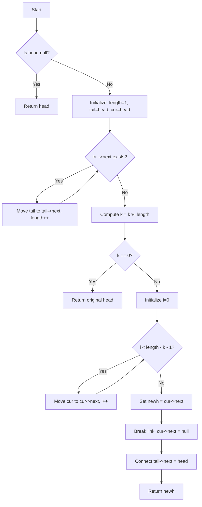
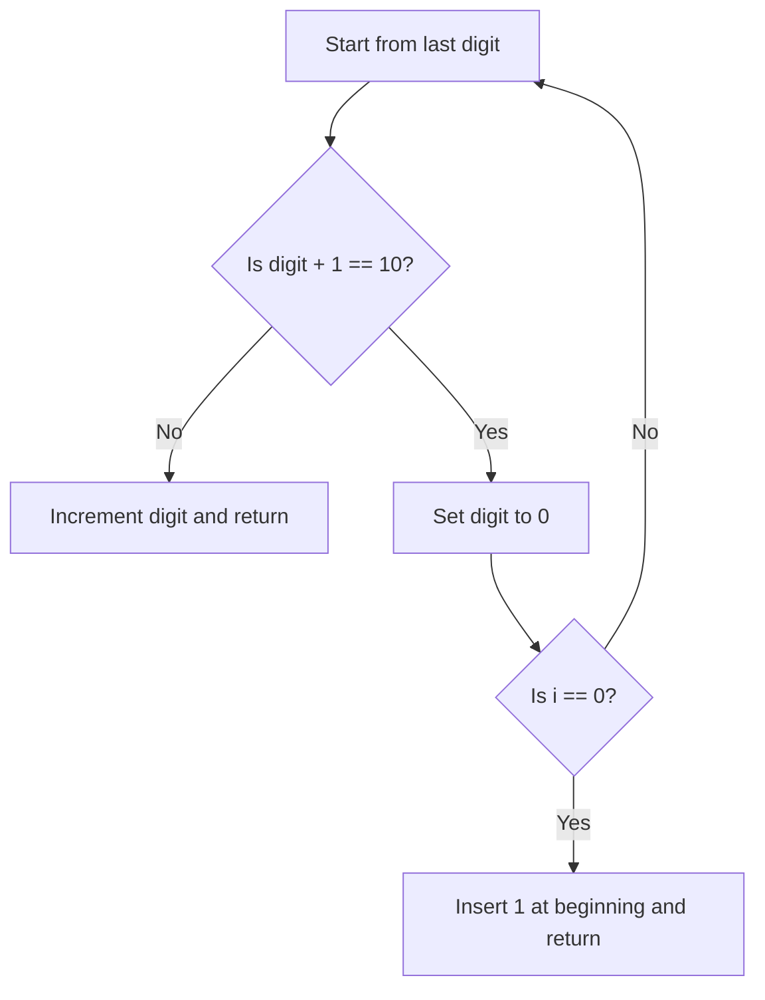

---

# 💡 C++ Code Explanation with Diagrams

---

## 🚀 Problem 1: Rotate List

### 🔍 Problem Statement

Given the head of a linked list, rotate the list to the right by `k` places.

### ✅ Approach

* Handle edge case: if the list is empty, return the head.
* Count the length of the list and get the tail node.
* Use `k = k % length` to handle unnecessary full rotations.
* If `k == 0`, the list doesn't need rotation.
* Traverse the list to the node just before the new head (`length - k - 1` steps).
* Set this node’s next to `nullptr` and update the tail’s next to point to the old head.
* Return the new head.

### 🧾 Code

```cpp
class Solution {
public:
    ListNode* rotateRight(ListNode* head, int k) {
        if (!head){
            return head;
        }
        int length = 1;
        ListNode* tail = head;
        ListNode* cur = head;
        while (tail->next){
            tail = tail->next;
            length++;
        }
        k = k % length;
        if (k == 0){
            return head;
        }
        for(int i = 0; i < length - k - 1; i++){
            cur = cur->next;
        }
        ListNode* newh = cur->next;
        cur->next = nullptr;
        tail->next = head;
        return newh;
    }
};
```

### 📈 Time & Space Complexity

* **Time Complexity:** O(n)
* **Space Complexity:** O(1)

### 🔁 Flowchart (Mermaid)



---

## 🚀 Problem 2: Plus One

### 🔍 Problem Statement

You are given a large integer represented as an integer array `digits`, where each `digits[i]` is a digit of the number. Increment the large integer by one and return the resulting array.

### ✅ Approach

* Traverse the array from the last digit toward the first.
* If adding one doesn't cause a carry (i.e., not 10), increment and return.
* If digit becomes 10, set it to 0 and continue.
* If all digits result in a carry (e.g., 999), insert `1` at the beginning.

### 🧾 Code

```cpp
class Solution {
public:
    vector<int> plusOne(vector<int>& digits) {
        for (int i = digits.size() - 1; i >= 0; i--) {
            if (digits[i] + 1 != 10) {
                digits[i] += 1;
                return digits;
            }
            digits[i] = 0;
            if (i == 0) {
                digits.insert(digits.begin(), 1);
                return digits;
            }
        }
        return digits;        
    }
};
```

### 📈 Time & Space Complexity

* **Time Complexity:** O(n)
* **Space Complexity:** O(1) (except in case of insert at beginning which is O(n))

### 🔁 Flowchart (Mermaid)



---
