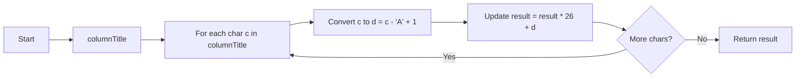
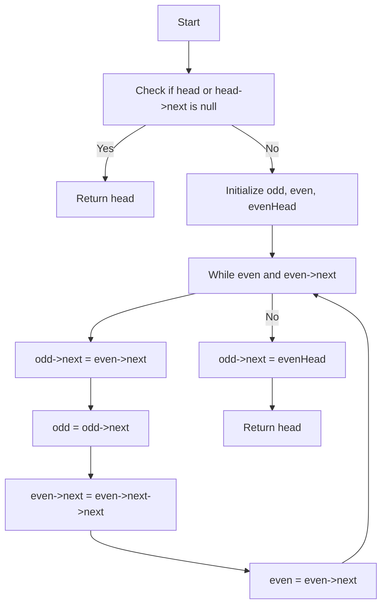

---

## 💡 C++ Code Explanation with Diagrams

---

### 🚀 Problem 3: Excel Sheet Column Number

#### 🔍 Problem Statement

Given a string `columnTitle` that represents the column title as appears in an Excel sheet, return its corresponding column number.
(Like `A` → 1, `AB` → 28, etc.)

---

#### ✅ Approach

* Initialize a result variable to 0.
* For each character in the string:

  * Convert it to its corresponding number using `c - 'A' + 1`.
  * Update the result as `result = result * 26 + d`.
* Return the result.

---

#### 🧾 Code

```cpp
class Solution {
public:
    int titleToNumber(string columnTitle) {
        int result = 0;
        for(char c : columnTitle) {
            int d = c - 'A' + 1;
            result = result * 26 + d;
        }
        return result;
    }
};
```

---

#### 📈 Time & Space Complexity

* **Time Complexity:** O(n), where `n` is the length of the column title
* **Space Complexity:** O(1)

---

#### 🧠 Insight

This is similar to converting a base-26 number to decimal. Each character acts like a digit in base 26.

---

#### 🔁 Flowchart (Mermaid)



---

### 🚀 Problem 4: Odd-Even Linked List

#### 🔍 Problem Statement

Given the head of a singly linked list, group all odd-indexed nodes together followed by the even-indexed nodes, and return the modified list. (1-based indexing)

---

#### ✅ Approach

* Check if the list is empty or has only one node.
* Use two pointers: `odd` and `even`, starting from the first and second nodes.
* Traverse the list by linking odd nodes to the next odd and even to the next even.
* Finally, connect the end of the odd list to the head of the even list.

---

#### 🧾 Code

```cpp
class Solution {
public:
    ListNode* oddEvenList(ListNode* head) {
        if (head == nullptr || head->next == nullptr) return head;

        ListNode* odd = head;
        ListNode* even = head->next;
        ListNode* evenHead = even;

        while (even != nullptr && even->next != nullptr) {
            odd->next = even->next;
            odd = odd->next;
            even->next = even->next->next;
            even = even->next;
        }

        odd->next = evenHead; 
        return head;
    }
};
```

---

#### 📈 Time & Space Complexity

* **Time Complexity:** O(n)
* **Space Complexity:** O(1) (in-place modification)

---

#### 🧠 Insight

Efficiently reorders nodes without using extra memory. Useful in situations where node positions are more important than values.

---

#### 🔁 Flowchart (Mermaid)



---


